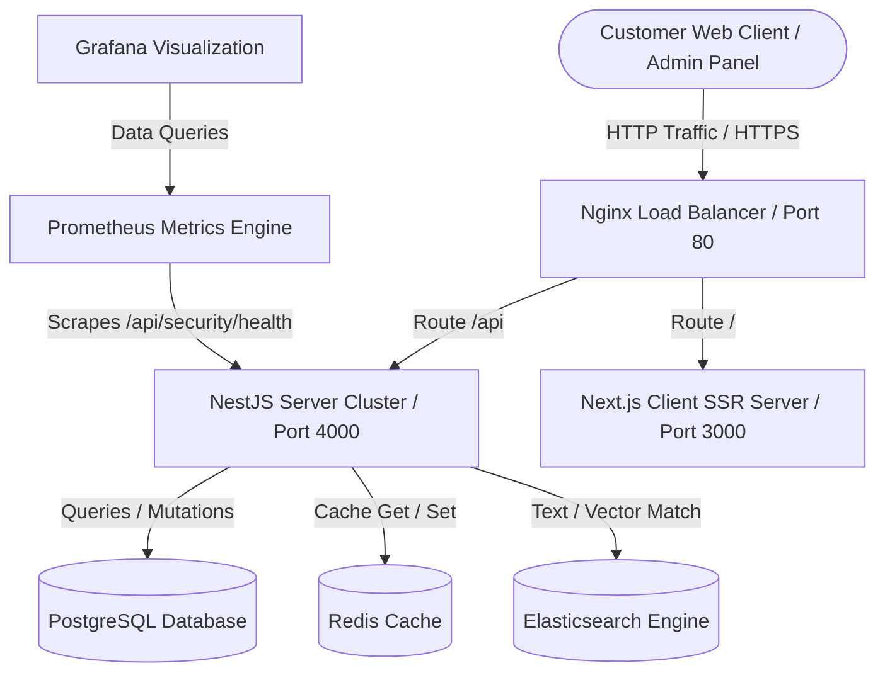

# Architecture Diagram & Developer Guide

## 1. System Architecture



---

## 2. Developer Guide

### Monorepo Workspaces Layout

- **`apps/api`**: NestJS modular application containing controllers, services, modules, guards, decorators, and Prisma ORM schemas.
- **`apps/web`**: Next.js 15 client dashboard featuring Redux state management and Tailwind CSS styling.
- **`packages/shared`**: Common types, schemas, and interface declarations.
- **`packages/ui`**: Shared atomic UI design system library.

### Development Workflow

1. **Initialize Workspace**:
   ```bash
   npm install
   ```
2. **Database Migrations**:
   ```bash
   npx prisma generate --schema=apps/api/prisma/schema.prisma
   ```
3. **Run Dev Environment**:
   ```bash
   npm run dev
   ```
   - Web Client: `http://localhost:3000`
   - NestJS API: `http://localhost:4000/api`
   - Swagger docs: `http://localhost:4000/docs`

### Code Quality Standards

- **Linter & Formatting**:
  ```bash
  npm run lint
  npm run format
  ```
- **Git Commit Rules**: Checked via Husky pre-commit rules. All commits must follow the conventional style:
  - `feat(web): add devops panel`
  - `fix(api): resolve Redis read errors`
